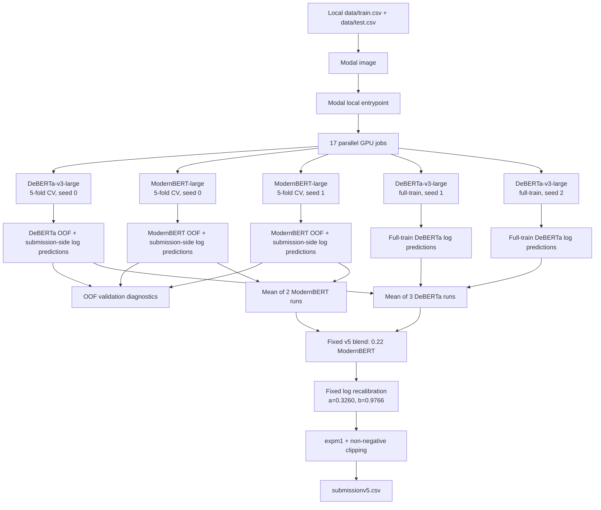

# HOLOGY 9.0 — Property Price Prediction From Sales Description (Task 2)

This repository contains the reproducible Modal training pipeline and the final Kaggle notebook for the **[Holomine] Property Price Prediction From Sales Desc Task 2** competition.

The main retraining entrypoint is [`solutions.py`](solutions.py). It retrains the v3 components, adds the full-train seeds used by v4, and writes the v5 submission artifact.

## Public Leaderboard Result

**Public score: `313285.10705` MAE**

[View the submission on Kaggle](https://www.kaggle.com/competitions/holomine-property-price-prediction-from-sales-desc-task-2/leaderboard)

## Architecture

The model is an ensemble of pretrained encoder-only language models. Each model receives the free-text sales description and predicts `log1p(listPrice)` through a regression head.



### Training stages

1. **Text preprocessing**
   - Fill missing descriptions with an empty string.
   - Rejoin split digit groups such as `10, 800-square-foot`.
   - Transform the target with `log1p` and standardize it using statistics computed from `train.csv`.

2. **Encoder fine-tuning**
   - `microsoft/deberta-v3-large`, `max_length=512`, learning rate `8e-6`.
   - `answerdotai/ModernBERT-large`, `max_length=1024`, learning rate `1e-5`.
   - Six epochs, batch size four, L1 loss, AdamW, cosine schedule, and six-percent warmup.
   - Mixed precision selects bfloat16 when supported and falls back to float16 otherwise.

3. **Validation and aggregation**
   - The three 5-fold runs use `KFold(5, shuffle=True, random_state=42)`.
   - v3 uses one DeBERTa run and two ModernBERT runs.
   - v4 adds two DeBERTa full-train seeds.
   - v5 averages the three DeBERTa prediction vectors and the two ModernBERT prediction vectors.

4. **Final v5 construction**
   - Blend in log space: `0.78 * DeBERTa + 0.22 * ModernBERT`.
   - Apply the frozen OOF-derived recalibration `0.3260 + 0.9766 * blend`.
   - Convert back with `expm1`, clip negative values to zero, and write `submissionv5.csv`.

The full-train seeds intentionally do not create OOF arrays. Their blend weight and recalibration are frozen from the OOF-based v3 recipe, so they only contribute additional prediction vectors.

## Run on Modal

Place the competition files in `data/`:

```text
data/
├── train.csv
└── test.csv
```

Authenticate once, then run from the repository root. On Windows, set UTF-8 output so the Modal CLI can render its status messages:

```powershell
$env:PYTHONIOENCODING = "utf-8"
modal token new
modal run solutions.py
```

For another local data directory:

```powershell
$env:PYTHONIOENCODING = "utf-8"
$env:HOLO_DATA_DIR = "C:\path\to\competition-folder"
modal run solutions.py
```

Optional arguments:

```powershell
modal run solutions.py --dry-run
modal run solutions.py --out outputs/submissionv5.csv --artifacts outputs/modal_v5_artifacts
```

The dry run lists all 17 jobs without starting GPU training. A normal run writes:

```text
submissionv5.csv
submission_v5.csv
modal_v5_artifacts/
├── oof_debL.npy
├── oof_mbertL.npy
├── oof_mbertL2.npy
├── test_debL.npy
├── test_mbertL.npy
├── test_mbertL2.npy
├── test_debL_f1.npy
├── test_debL_f2.npy
└── v5_blend_log.npy
```

The prediction arrays are local outputs from the Modal run; they are not required as inputs for a fresh retraining run.
